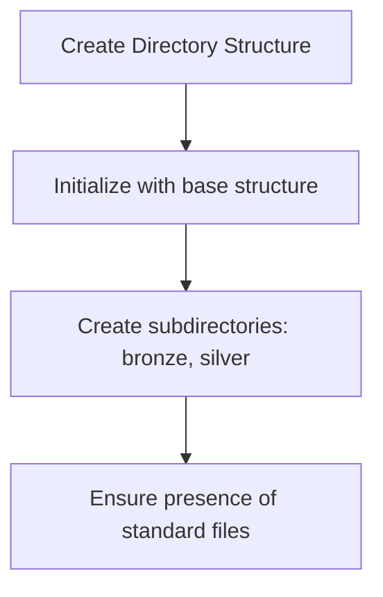
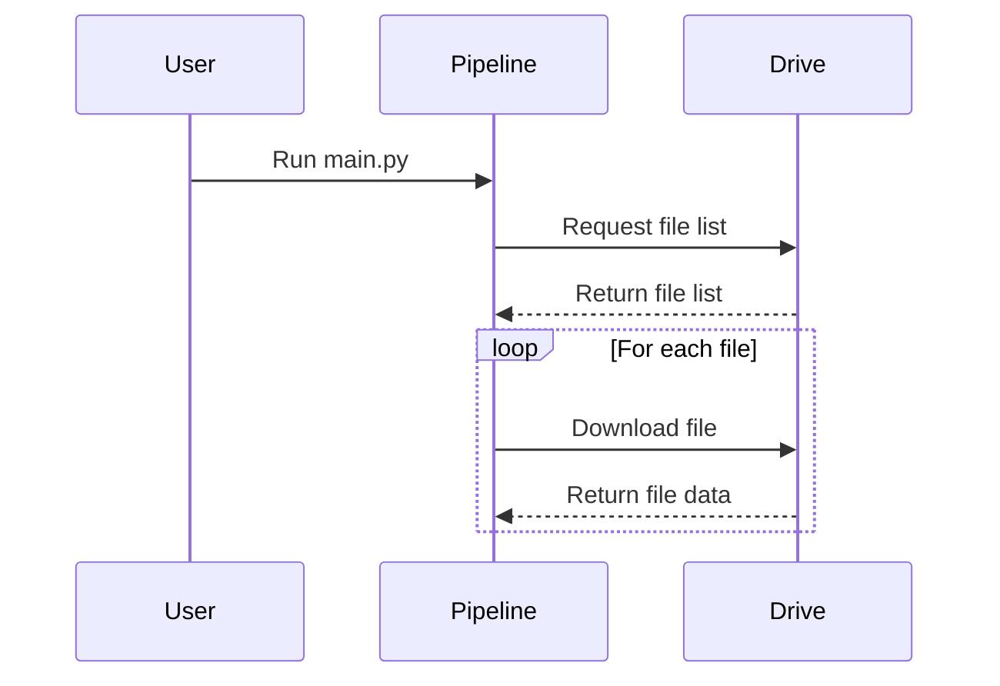
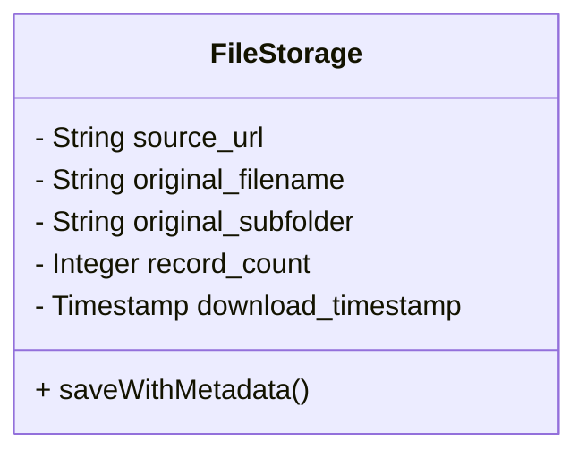
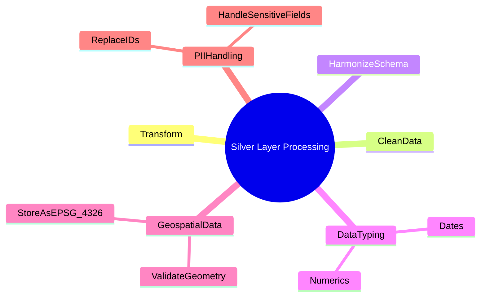
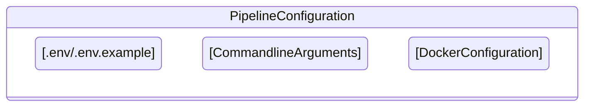
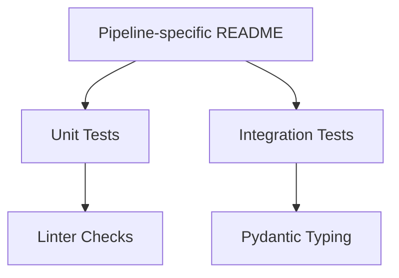

# [[{"id": "ede029e1-79d0-4437-b6c2-41f3cbb5a9fa", "doc_id": null, "project_id": null, "parent_id": null, "status": "", "tags": [], "file_list": [], "profiles": ["analyst"], "users": [], "name": "new data pipeline to fetch files from a specified Google Drive folder", "created_at": "2025-04-20 11:54:31.950532", "updated_at": "2025-04-20T15:29:48.286479", "mode": "chat", "kanban_id": "", "column_id": "", "board": "Upwork - Offers", "column": "Backlog", "chat_index": 0, "url": "", "branch": "", "file_path": "/shared/codx-junior-projects/landbruget/.codx/tasks/Upwork - Offers/Backlog/new data pipeline to fetch files from a specified Google Drive folder.ede029e1-79d0-4437-b6c2-41f3cbb5a9fa.md", "model": "", "visibility": ""}]]
## [[{"doc_id": "90c53acd-4634-4056-ba4a-9e197f40cc84", "role": "user", "task_item": "", "hide": true, "improvement": false, "created_at": "2025-04-20 11:54:31.948698", "updated_at": "2025-04-20 11:54:31.948725", "images": [], "files": [], "meta_data": {}, "profiles": [], "user": "admin"}]]
https://github.com/Klimabevaegelsen/landbruget.dk/issues/253

Objective:
Develop a new data pipeline to fetch files from a specified Google Drive folder, process them into Bronze and Silver layers according to the project's medallion architecture, and adhere to established coding standards and best practices.

Source Data:

Location: Google Drive Folder - https://drive.google.com/drive/folders/18-Tvu8pX5ZCLAfZyRujGT8JRa5uRLKUz
Structure: This folder contains multiple subfolders, including:
Animal Mortality
Animal Welfare
Pesticides
Pig International Movements
Pig Tail Cutting
Slurry leaks
Stable fires
Subsidies
Transportation accidents
Visa
Worker Safety
Type: Static files in PDF and excel formats
Access: The pipeline needs to handle fetching files from within these subfolders. Investigate if public download links (uc?export=download&id={file_id}) can be obtained for files within the subfolders or if Google Drive API access with appropriate credentials is required to list and download files recursively.

Pipeline Requirements:

Project Setup:

Create a new directory backend/pipelines/drive_data_pipeline (or a more specific name reflecting the overall data theme, e.g., animal_welfare_pipeline).
Initialize the directory using the structure from backend/pipelines/base/.
Ensure standard files are present: .env.example, README.md, main.py, Dockerfile, docker-compose.yml, pyproject.toml.
Create bronze/ and silver/ subdirectories.

Bronze Layer Implementation:

Fetching:
Implement logic in main.py to recursively list and download files from the specified Google Drive folder and its subfolders. Adapt the fetch_from_drive function example from backend/pipelines/README.md or use the Google Drive API.
If API access is needed, implement necessary authentication and API calls for listing folder contents and downloading files.
Handle large files using streaming/chunking.
Implement error handling for download failures (e.g., network issues, permissions, missing files).
Storage:
Save downloaded files unmodified to the bronze/ directory within timestamped subfolders (e.g., data/bronze/YYYYMMDD_HHMMSS/).
Consider mirroring the source subfolder structure within the timestamped bronze directory (e.g., data/bronze/YYYYMMDD_HHMMSS/Animal_Mortality/) or incorporating the source subfolder name into the metadata.
Preserve the original file format.
Generate a metadata.json file alongside each data file, including timestamp, source_url, original_filename, original_subfolder, record count (if applicable), etc. (Ref: save_with_metadata example).
Adhere to storage guidelines in backend/README.md (local when local, GCS for prod).

Silver Layer Implementation:

Processing:
Develop logic to clean, transform, and harmonize the raw data fetched in the Bronze step. Handle potential variations in schema/format across different subfolders.
Prioritize DuckDB and Ibis for data manipulation over pandas/geopandas where feasible.
Data Typing: Ensure correct data types (dates, timestamps, numerics, booleans as 0/1). Handle special characters (æ, ø, å) correctly.
Geospatial Data: If present, validate geometries, store as EPSG:4326, use geometry types (not text), dissolve/index as appropriate.
Naming Conventions: Follow conventions in backend/README.md (English, lowercase_underscore, max 5 words, geo_ prefix).
NULL Values: Represent missing data consistently as NULL.
PII Handling: Identify and handle potential PII (e.g., replace IDs with UUIDs, remove sensitive fields, retain marketing opt-outs) as per backend/README.md.
Storage:
Save processed data to the silver/ directory. Decide on a unified schema or separate outputs based on source subfolders/data types.
Use Parquet/GeoParquet format
Structure output logically, potentially in timestamped folders or according to a defined Silver layer schema reflecting the harmonized data.

Configuration & Environment:

Define required environment variables (e.g., GOOGLE_DRIVE_FOLDER_ID, API credentials if needed) in .env and document them with examples in .env.example.
Use command-line arguments (argparse) for runtime parameters (e.g., specific subfolders to process, date ranges, processing flags, log level).

Containerization:

Create a Dockerfile using an appropriate Python base image (e.g., python:3.11-slim).
Install dependencies via uv . (using pyproject.toml).
Configure docker-compose.yml for local development and testing, including volume mounts and environment variable injection (env_file).

Documentation & Testing:

Write a pipeline-specific README.md detailing its purpose, setup, configuration variables, required permissions/authentication, and execution steps.
Implement unit/integration tests covering fetching from subfolders, core processing logic for different potential file types, and data validation.
Follow project linting (Ruff) and typing (Pydantic) standards (backend/README.md).

Best Practices:

Implement comprehensive logging throughout the pipeline stages, including which subfolder is being processed.
Include robust error handling (e.g., retries for fetching, graceful failure for processing steps, skipping problematic files/folders with logging).
Refer to chr_pipeline and svineflytning_pipeline for structural examples and implementation patterns (authentication, parallel processing, error handling).

Acceptance Criteria:

Pipeline successfully lists and fetches data from the specified Google Drive folder and its subfolders.
Raw data is correctly stored in the Bronze layer with appropriate metadata, including source subfolder information.
Data from various subfolders is cleaned and transformed according to Silver layer specifications and project standards.
Processed Silver data is stored in the specified format and location, potentially unified or structured by source type.
The entire pipeline executes successfully within Docker.
Code includes relevant tests and is well-documented.
The pipeline adheres to all guidelines in backend/README.md and backend/pipelines/README.md.

References:

Main Backend Readme: backend/README.md
Pipeline Creation Guide: backend/pipelines/README.md
CHR Pipeline Example: backend/pipelines/chr_pipeline/
Svineflytning Pipeline Example: backend/pipelines/svineflytning_pipeline/
Source Data Folder: https://drive.google.com/drive/folders/18-Tvu8pX5ZCLAfZyRujGT8JRa5uRLKUz
## [[{"doc_id": "3414ab1f-a79d-4d4a-b9fc-be2fc7978673", "role": "assistant", "task_item": "analysis", "hide": false, "improvement": false, "created_at": "2025-04-20 11:54:31.948698", "updated_at": "2025-04-20T15:29:26.730Z", "images": [], "files": [], "meta_data": {"time_taken": 15.471435308456421, "first_chunk_time_taken": 3.681757926940918, "model": "gpt-4o"}, "profiles": [], "user": null}]]
### Task 1: Project Setup

#### Objective
- Set up the initial pipeline structure and environment configuration.
- Visual representation:

#### Requirements
- Create a new directory `backend/pipelines/drive_data_pipeline`.
- Initialize the directory using the structure from `backend/pipelines/base/`.
- Ensure presence of essential files like `.env.example`, `README.md`, `main.py`, `Dockerfile`, `docker-compose.yml`, `pyproject.toml`.
- Create `bronze/` and `silver/` subdirectories.

#### Acceptance Criteria
- Directory and subdirectory structure is correctly set up.
- All standard files are present.

#### Definition of done
* [X] Directory structure is created.
* [X] All necessary files are present.

---

### Task 2: Bronze Layer Implementation - Fetching

#### Objective
- Implement file fetching logic from the Google Drive folder.
- Visual representation:

#### Requirements
- Implement logic in `main.py` to recursively list and download files from the Google Drive folder.
- Decide between adapting `fetch_from_drive` function or using Google Drive API.
- Ensure authentication and API calls are implemented if API access is needed.
- Handle large files using streaming/chunking.
- Implement error handling for download failures.

#### Acceptance Criteria
- Files are successfully listed and fetched from Google Drive.
- Errors in downloading are handled gracefully.

#### Definition of done
* [] Fetching logic is implemented and functional.
* [] Error handling for downloads is in place.

---

### Task 3: Bronze Layer Implementation - Storage

#### Objective
- Store downloaded files unmodified with metadata.
- Visual representation:

#### Requirements
- Save downloaded files to `bronze/` directory within timestamped subfolders.
- Mirror the source subfolder structure within the timestamped directory.
- Generate a `metadata.json` alongside each data file with necessary details.

#### Acceptance Criteria
- Files are stored in the bronze layer with metadata.
- Source subfolder structure is mirrored.

#### Definition of done
* [] Files are stored with necessary metadata.
* [] Subfolder structure is correctly mirrored.

---

### Task 4: Silver Layer Implementation - Processing

#### Objective
- Process raw data into a structured, cleaned, and harmonized form.
- Visual representation:

#### Requirements
- Clean, transform, and harmonize data from the Bronze layer.
- Use DuckDB and Ibis for data manipulation where feasible.
- Ensure correct data types and handle special characters.
- Validate and store geospatial data correctly.
- Follow naming conventions in backend README.
- Handle missing data as NULL and manage PII appropriately.

#### Acceptance Criteria
- Data is processed according to Silver layer specifications.
- Conforms to data typing, PII, and naming conventions.

#### Definition of done
* [] Data is cleaned and transformed.
* [] Proper data types and handling are ensured.

---

### Task 5: Configuration & Environment

#### Objective
- Set up the environment and configuration for pipeline execution.
- Visual representation:

#### Requirements
- Define environment variables in `.env`, document in `.env.example`.
- Implement command-line arguments using argparse for runtime parameters.
- Configure docker environment for local development and testing.

#### Acceptance Criteria
- Environment variables and runtime parameters are clearly defined and documented.
- Docker configuration supports local testing.

#### Definition of done
* [] Environment configuration is completed.
* [] Docker setup is verified for testing.

---

### Task 6: Documentation & Testing

#### Objective
- Provide documentation and test coverage for the pipeline.
- Visual representation:

#### Requirements
- Write a specific `README.md` for pipeline setup and execution.
- Implement unit/integration tests for fetching and processing logic.
- Ensure compliance with linting and typing standards.

#### Acceptance Criteria
- Clear documentation is provided.
- Tests are implemented and passing.

#### Definition of done
* [] Documentation is complete.
* [] Tests are implemented and successful.

