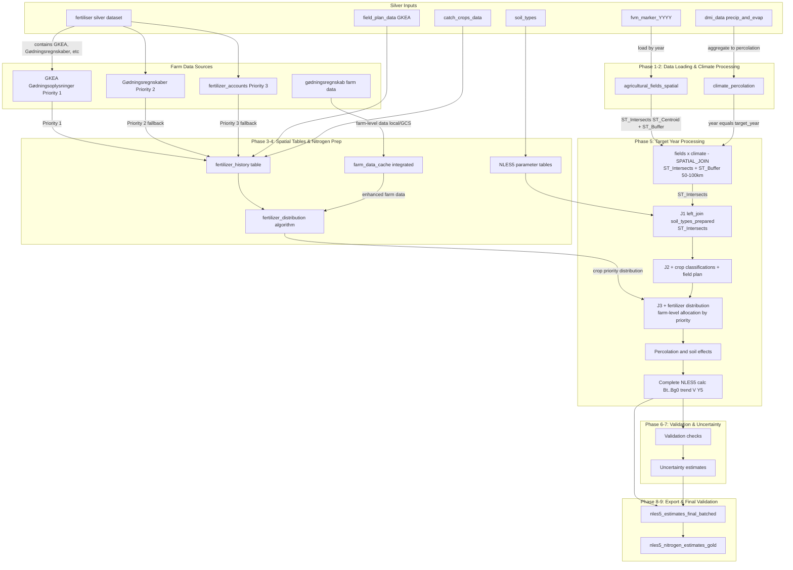

## NLES5 Pipeline Data Flow

This document shows how data is connected and joined throughout the NLES5 nitrogen estimation pipeline, and in what order operations occur.

## Pipeline Phases (10 Phases Total)

1. **Phase 1**: Load required silver datasets (soil, climate, fertilizer, etc.)
2. **Phase 1.5**: Load agricultural fields data (FVM marker data)
3. **Phase 1.5.1**: Validate field IDs before processing
4. **Phase 1.6**: Load farm-level gødningsregnskab data for enhanced accuracy
5. **Phase 2**: Process climate data to calculate percolation
6. **Phase 3**: Create spatial tables and NLES5 parameter tables
7. **Phase 4**: Prepare nitrogen input tables (fertilizer history + distribution algorithm)
8. **Phase 5**: NLES5 target-year-by-target-year processing (main calculations)
9. **Phase 6**: Validate NLES5 estimates
10. **Phase 7**: Calculate uncertainty estimates
11. **Phase 8**: Final analysis and results export
12. **Phase 9**: Final validation of completed pipeline

## Key Technical Details

### Spatial Joins
- **Method**: `ST_Intersects(ST_Centroid(f.geom), ST_Buffer(c.geometry, distance))`
- **Buffer distances**: 50km for target-year processing, 100km for main spatial join
- **Year filtering**: `ABS(f.year - c.year) <= 2` (3-year window)

### Fertilizer Distribution
- **Algorithm**: Official Danish NLES5 methodology (N2023_62, Tabel 7)
- **Crop priorities**: 7-level priority system for organic fertilizer allocation
- **Distribution methods**: Proportional (organic > 50% quota) vs Priority-based (organic ≤ 50% quota)
- **Farm-level allocation**: Budgets distributed to fields based on N-quota requirements

### Fertilizer Data Sources (Priority Order)
- **Priority 1**: GKEA Gødningsoplysninger files (target year specific)
- **Priority 2**: Gødningsregnskaber files (fertilizer accounts)
- **Priority 3**: Generic fertilizer_accounts data (fallback)
- **Enhanced data**: Farm-level gødningsregnskab data for actual farm values (C_2016, C_2006, F_901, F_902, etc.)

### Farm Data Integration
- **Source**: Local files (data/In-depth/GR YYYY/) or future GCS parquet
- **Contents**: Animal production data (C_2016, C_2006) and detailed fertilizer applications (F_901, F_902, F_512, F_703_1, F_706_1, F_308_1)
- **Purpose**: Replace estimated values with actual farm-specific data for enhanced accuracy
- **Validation**: Comprehensive quality controls per N2023_62 Table 1 (21 validation rules)

### Output Tables
- **Intermediate**: `nles5_estimates_final_batched` (per batch/year)
- **Final**: `nles5_nitrogen_estimates_gold` (consolidated results)
- **Analysis tables**: `nles5_estimates_analysis`, `nles5_uncertainty_estimates`, etc.

## Notes
- Fields are spatially joined to climate per year using ST_Intersects with buffered climate points; then joined to soil polygons.
- Fertilizer data uses sophisticated distribution algorithm that allocates farm-level budgets to fields based on crop priorities and N-quota requirements.
- **Data source priority**: Pipeline prioritizes GKEA files over Gødningsregnskaber over generic fertilizer accounts for the most accurate data.
- **Enhanced accuracy**: Farm-level gødningsregnskab data (when available) replaces estimated values with actual farm-specific fertilizer applications and animal production data.
- **Validation**: Comprehensive quality controls ensure data integrity per Danish NLES5 methodology (N2023_62, Table 1).
- Pipeline processes data in target-year batches for memory efficiency.
- Final export table is `nles5_nitrogen_estimates_gold`.

