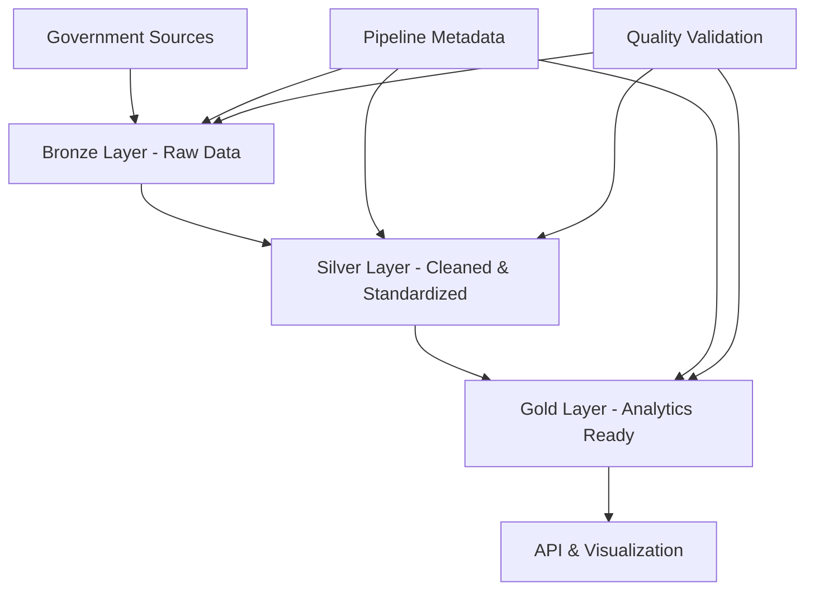

# Comprehensive Data Lineage Documentation

> **Complete Data Provenance**: End-to-end traceability of all agricultural data from original government sources through final analytical datasets

---

## Overview

This document provides complete transparency of data flow across all pipelines in the Danish Agricultural Data Infrastructure. Every dataset can be traced from its original government source through all transformation steps to final analytical outputs, ensuring full accountability and enabling users to assess data quality, reliability, and fitness for their specific use cases.

### Why Data Lineage Matters
- **Transparency**: Complete visibility into data origins and transformations
- **Trust**: Users can verify data authenticity and processing accuracy
- **Quality Assessment**: Understanding of potential data quality impacts at each stage
- **Compliance**: Meeting regulatory requirements for data provenance documentation
- **Debugging**: Rapid identification of data quality issues and their sources
- **Impact Analysis**: Understanding downstream effects of source data changes

---

## Data Architecture Overview

The Danish Agricultural Data Infrastructure follows a consistent medallion architecture across all pipelines:



### Layer Definitions
- **Bronze Layer**: Raw data preservation with no transformations, maintaining exact copies of source data
- **Silver Layer**: Cleaned, standardized, and validated data optimized for analysis
- **Gold Layer**: Aggregated, enriched, and analysis-ready datasets for specific use cases
- **Pipeline Metadata**: Complete tracking of data lineage, processing timestamps, and quality metrics

---

## Complete Data Source Inventory

### Primary Government Data Sources

| Source Agency | Data Type | Update Frequency | Access Method | Pipeline |
|---------------|-----------|------------------|---------------|----------|
| **Miljøstyrelsen** | Pesticide registrations (BMD) | Monthly | Web scraping | BMD Scraper |
| **Miljøstyrelsen** | Environmental permits (DMA) | Monthly | Web scraping | DMA Scraper |
| **Arbejdstilsynet** | Workplace inspections | Continuous | CSV download | Arbejdstilsynet Scraper |
| **FVM** | Agricultural fields | Annual | WFS service | Unified Pipeline (FVM WFS) |
| **FVM** | Animal movements | Real-time | SOAP service | CHR Pipeline |
| **FVM** | Veterinary treatments | Real-time | SOAP service | CHR Pipeline |
| **DMI** | Weather data | Monthly | API | Unified Pipeline (DMI) |
| **Danmarks Statistik** | Agricultural statistics | Annual | API | Unified Pipeline (DST) |
| **Datafordeleren** | Cadastral parcels | Continuous | WFS service | Unified Pipeline (Cadastral) |
| **Datafordeleren** | Property ownership | Annual | SFTP | Property Owners SFTP |
| **Datafordeleren** | Administrative boundaries | Annual | API | Unified Pipeline (DAGI) |
| **SDFE** | Building registry | Continuous | FTP/WFS | BBR Buildings |
| **Environmental Portal** | Soil types | Annual | WFS service | Unified Pipeline (Soil Types) |
| **Environmental Portal** | Wetlands | Annual | WFS service | Unified Pipeline (Wetlands) |
| **Environmental Portal** | Water typology | Annual | WFS service | Unified Pipeline (Water Typology) |
| **Environmental Portal** | Protected areas (BNBO) | Annual | WFS service | Unified Pipeline (BNBO) |
| **Environmental Portal** | Water projects | Annual | WFS/ArcGIS | Unified Pipeline (Water Projects) |
| **Google Drive** | Regulatory compliance data | Manual | Drive API | Drive Data Pipeline |

---

## Detailed Pipeline Data Lineage

### 1. Unified Pipeline Data Flow

The Unified Pipeline processes the majority of agricultural data through a sophisticated multi-source, multi-schedule architecture:

#### Manual Workflows (On-demand execution)

**Soil Types Workflow**
```
Source: Environmental Portal WFS → Bronze: Raw GML → Silver: Validated geometries + standardized attributes → Gold: Spatial analysis ready
```
- **Transformations**: GML to GeoJSON conversion, geometry validation, CRS transformation to WGS84
- **Quality Checks**: Geometry validity, attribute completeness, coordinate bounds validation
- **Output**: Standardized soil classification data for agricultural analysis

**Wetlands Workflow**
```
Source: Environmental Portal WFS → Bronze: Raw XML batches → Silver: Dissolved geometries + overlap resolution → Gold: Spatial analysis ready
```
- **Transformations**: XML parsing, connected components algorithm for dissolution, overlap resolution in EPSG:25832
- **Quality Checks**: Geometry validity, adjacency detection, area calculations
- **Output**: Clean wetland boundaries for environmental analysis

**Water Typology Workflow**
```
Source: Environmental Portal WFS → Bronze: Raw GML → Silver: Multi-layer integration + geometry validation → Gold: Spatial analysis ready
```
- **Transformations**: GML to WKT conversion, multi-layer data combination, CRS transformation
- **Quality Checks**: Geometry validation, attribute standardization, layer consistency
- **Output**: Comprehensive water body classification data

**Pesticide Disaggregation Workflow**
```
Source: Multiple gold layers → Processing: 4-strategy field matching → Output: Field-level pesticide applications
```
- **Input Sources**: Pesticide applications (company-level) + FVM field boundaries + BMD product data
- **Transformations**: Area matching (2% tolerance), non-organic matching, partial field coverage, temporal Y+1 pattern
- **Quality Checks**: 92% coverage validation, area tolerance verification, temporal consistency
- **Output**: Field-level pesticide application records

**DMI Weather Workflow**
```
Source: DMI GovCloud API → Bronze: Monthly GeoJSON → Silver: Statistical aggregations → Gold: Climate analysis ready
```
- **Transformations**: Month-by-month data fetching, GeoJSON processing, CRS transformation, statistical calculations
- **Quality Checks**: Temporal continuity, coordinate validation, statistical outlier detection
- **Output**: Monthly climate data with statistical aggregations

#### Weekly Workflows (Every Monday 2 AM UTC)

**CVR Enrichment Workflow**
```
Source: CVR API + Collected CVR numbers → Processing: Geocoding + enrichment → Output: Company profiles
```
- **Transformations**: CVR number validation, address geocoding, company data enrichment
- **Quality Checks**: CVR format validation, geocoding accuracy, data completeness
- **Output**: Enriched company profiles with geographic coordinates

#### Monthly Foundation Workflows (1st of month, 1 AM UTC)

**DST Statistics Workflow**
```
Source: Danmarks Statistik API → Bronze: JSONSTAT format → Silver: Relational tables → Gold: Agricultural statistics
```
- **Transformations**: JSONSTAT parsing using ibis, multi-dimensional data flattening, table-specific processing
- **Quality Checks**: Dimension validation, value consistency, temporal alignment
- **Output**: Agricultural production and economic statistics

**FVM WFS Agricultural Fields**
```
Source: FVM WFS service → Bronze: GeoJSON batches → Silver: Validated geometries → Gold: Field boundaries
```
- **Transformations**: Concurrent WFS fetching, GeoJSON extraction, geometry validation, CRS transformation
- **Quality Checks**: Geometry validity, field ID consistency, area calculations
- **Output**: Complete Danish agricultural field boundaries with crop classifications

**Cadastral Parcels Workflow**
```
Source: Datafordeleren WFS 2.0.0 → Bronze: GML MultiSurface → Silver: Validated parcels + dissolved layer → Gold: Cadastral analysis
```
- **Transformations**: GML MultiSurface parsing to WKT, geometry validation, dissolution processing
- **Quality Checks**: Geometry validity, parcel ID consistency, area calculations
- **Output**: Danish cadastral parcel boundaries with property identifiers

#### Monthly Dependent Workflows (After foundation completes)

**Property Cadastral Merge Workflow**
```
Source: Property owners (SFTP) + Cadastral (Silver) → Processing: BFE number joins → Output: Merged property data
```
- **Transformations**: Memory-optimized streaming joins, BFE number matching, data harmonization
- **Quality Checks**: Join success rates, data consistency, relationship validation
- **Output**: Property ownership data linked to cadastral boundaries

**Field Production Estimation**
```
Source: FVM fields + DST statistics → Processing: Crop mapping + yield calculations → Output: Field-level production estimates
```
- **Transformations**: Comprehensive crop mapping, spatial joins, yield estimation algorithms, year-by-year processing
- **Quality Checks**: Crop classification accuracy, yield reasonableness, temporal consistency
- **Output**: Estimated production values for individual agricultural fields

**Field Area Analysis**
```
Source: Multiple spatial layers → Processing: 5-stage spatial analysis → Output: Comprehensive field characteristics
```
- **Input Sources**: FVM fields + BNBO + Water projects + Wetlands + Property ownership
- **Transformations**: Pre-filtering optimization, batched spatial joins using DuckDB SPATIAL_JOIN, multi-stage processing
- **Quality Checks**: Spatial accuracy validation, area consistency, relationship verification
- **Output**: Complete field-level spatial analysis with environmental and ownership characteristics

### 2. CHR Pipeline Data Flow

**Animal Movement and Health Data Processing**
```
FVM SOAP Services → Bronze: Raw XML → Silver: Structured tables → Gold: Analytical datasets
```

**Data Sources and Processing**:
- **Species/Usage Data**: CHR_stamdataWS → Species and usage combinations
- **Herd Discovery**: CHR_besaetningWS → Herd lists with pagination (FraBesNr/TilBesNr)
- **Animal Movements**: DIKOWS → Species-specific movement records (Cattle, Sheep, Goats, Pigs)
- **Property Data**: CHR_ejendomWS → Farm property information
- **Veterinary Data**: VetStat External → Antibiotic usage with PKI certificate authentication

**Transformations**:
- XML digital signature processing for VetStat
- Complex pagination handling for large datasets
- Species-driven herd discovery algorithms
- `ibis` framework processing for silver layer transformations
- Privacy protection through PII exclusion

**Quality Checks**:
- WSDL compliance validation
- Species validation against `VALID_DIKO_SPECIES`
- Temporal consistency verification
- Data completeness assessment

### 3. Drive Data Pipeline Data Flow

**Google Drive Regulatory Data Processing**
```
Google Drive API → Bronze: Raw files → Silver: Transformed data → Gold: Compliance analysis
```

**12 Data Sources**:
1. **Animal Welfare** → Excel/PDF processing → Welfare incident records
2. **Fertiliser** → Schema harmonization → Standardized fertiliser usage
3. **Pesticides** → Data extraction → Pesticide application records
4. **Work Permits** → PDF table extraction → Agricultural work permit statistics
5. **Worker Safety** → Data processing → Safety incident records
6. **Stable Fires** → Event processing → Fire incident data
7. **Slurry Leaks** → Environmental processing → Leak incident records
8. **Transportation Accidents** → Accident processing → Transport incident data
9. **Subsidies** → Financial processing → Agricultural subsidy records
10. **Pig Tail Cutting** → Welfare processing → Animal welfare compliance
11. **International Animal Movements** → Movement processing → Cross-border animal transport
12. **Animal Mortality** → Health processing → Livestock mortality data

**Specialized Transformers**:
- **WorkPermitsTransformer**: PDF table extraction using `pdfplumber`, CVR number identification, nationality recognition
- **FertiliserTransformer**: Schema harmonization across multiple sources (Efterafgrøder, GKEA markplan, Gødningsregnskaber)
- **AdvancedPDFTransformer**: Generic PDF processing capabilities
- **ExcelTransformer**: Structured Excel data processing

### 4. Scraper Pipelines Data Flow

**BMD Pesticide Database**
```
BMD Portal → Form automation → Excel generation → Download → Parquet transformation
```
- **Authentication**: Verification token extraction and form automation
- **Processing**: Server-side Excel generation, document polling, integrity verification
- **Transformations**: Column standardization, data type casting, date parsing, status normalization

**DMA Environmental Authority**
```
DMA Portal → Async scraping → Company details + PDFs → Structured data
```
- **Processing**: Concurrent requests (20 parallel), BeautifulSoup parsing, PDF collection
- **Data Extraction**: 5 data sections (Grunddata, Adresse, Aktiviteter, Myndighed, IED-oplysninger)
- **Transformations**: Date filtering (Tilsynsdato), livestock activity code filtering, data standardization

**Arbejdstilsynet Work Environment**
```
CSV Source → Docker processing → Privacy protection → Parquet output
```
- **Processing**: Containerized execution with xvfb virtual display
- **Transformations**: Date range filtering, column standardization, PII anonymization
- **Quality Checks**: Data deduplication, value normalization, completeness validation

### 5. Specialized Pipelines Data Flow

**H3 PFAS Exposure Analysis**
```
Multiple gold sources → H3 grid generation → Spatial joins → Exposure calculations
```
- **Input Sources**: Pesticide disaggregation + FVM fields + BMD products + DAGI municipalities
- **Processing**: 13.5M H3 cell generation, 5-stage spatial joins, chunked processing (10,000-50,000 cells)
- **Resolutions**: Multi-resolution analysis (7: ~516ha, 8: ~74ha, 9: ~11ha, 10: ~1.5ha)
- **Output**: PFAS exposure maps with Kepler.gl visualization compatibility

**Svineflytning Pig Movement Tracking**
```
FVM SvineflytningWS → SOAP processing → Movement records → Analytical tables
```
- **Processing**: 5-year historical data, 3-day API chunks, parallel processing (5 concurrent)
- **Transformations**: Three table structure (movements, properties, vehicles)
- **Quality Checks**: Movement validation, CHR number verification, temporal consistency

**Property Owners SFTP Processing**
```
Datafordeleren SFTP → VM processing → Privacy transformation → Parquet output
```
- **Security**: Google Cloud VM (e2-standard-8), IP whitelisting, CPR anonymization
- **Processing**: 8.5M records, batch processing (500,000 records), 98.3% compression
- **Privacy**: CPR → UUID mapping, personal data removal, abroad flag derivation

### 6. BBR Buildings Pipeline Data Flow

**Building Registry Processing**
```
INSPIRE BBR (SDFE) + GeoDanmark WFS → UUID joins → Building classification
```
- **Data Sources**: DK_INSPIRE_BBR.gpkg (5.56M+ buildings) + GeoDanmark WFS + GraphQL API
- **Processing**: UUID-based joins (63.9% match rate), building classification, spatial processing
- **Classifications**: Agricultural (210), Residential (110-540), Education (420-441), Daycare (440-441)
- **Output**: Comprehensive building dataset for exposure risk assessment

---

## Cross-Pipeline Data Dependencies

### Critical Data Relationships

**Field-Centric Integration**
```
FVM Fields (Silver) → Field Production (Gold)
                   → Field Area Analysis (Gold)  
                   → Pesticide Disaggregation (Gold)
                   → H3 PFAS Exposure (Specialized)
```

**Company-Centric Integration**
```
CVR Enrichment (Weekly) → CHR Pipeline (Properties)
                        → Drive Data (CVR extraction)
                        → DMA Scraper (CVR validation)
                        → Pesticide Disaggregation (Company matching)
```

**Spatial Analysis Integration**
```
Cadastral (Silver) → Property Cadastral Merge (Gold)
                   → Field Area Analysis (Gold)
                   
BNBO + Water Projects + Wetlands → Field Area Analysis (Gold)

Buildings (BBR) → H3 PFAS Exposure (Risk assessment)
```

**Regulatory Compliance Integration**
```
BMD Products → Pesticide Disaggregation → H3 PFAS Exposure
Drive Data → Compliance monitoring across multiple domains
Scraper Pipelines → Regulatory oversight and enforcement tracking
```

---

## Data Quality and Validation Framework

### Quality Assurance at Each Layer

#### Bronze Layer Quality Checks
- **Source Integrity**: Checksum validation, file completeness verification
- **Format Validation**: Schema compliance, data type consistency
- **Temporal Consistency**: Update frequency validation, timestamp accuracy
- **Completeness**: Missing data identification, coverage assessment

#### Silver Layer Quality Checks
- **Geometry Validation**: Spatial data integrity, coordinate system accuracy
- **Attribute Standardization**: Column naming consistency, value normalization
- **Relationship Integrity**: Foreign key validation, referential consistency
- **Data Deduplication**: Duplicate record identification and resolution

#### Gold Layer Quality Checks
- **Analytical Accuracy**: Calculation validation, statistical reasonableness
- **Cross-Pipeline Consistency**: Data alignment across related datasets
- **Business Rule Compliance**: Domain-specific validation rules
- **Performance Validation**: Processing efficiency and resource utilization

### Comprehensive Validation Metrics

| Pipeline Category | Key Quality Metrics | Validation Methods |
|------------------|-------------------|-------------------|
| **Unified Pipeline** | Coverage rates, geometry validity, temporal consistency | Automated validation, statistical outlier detection |
| **CHR Pipeline** | Data completeness, species validation, temporal alignment | WSDL compliance, business rule validation |
| **Drive Data** | File processing success, CVR extraction accuracy | Format validation, content verification |
| **Scrapers** | Scraping success rates, data freshness, completeness | Automated monitoring, integrity checks |
| **Specialized** | Spatial accuracy, privacy compliance, processing efficiency | Advanced validation algorithms, compliance audits |

---

## Data Retention and Historical Coverage

### Retention Policies by Pipeline

**Long-Term Historical Data (5+ years)**
- Agricultural field boundaries and crop classifications
- Weather and climate data
- Property ownership and cadastral information
- Animal movement and health records
- Pesticide registration and usage data

**Medium-Term Data (2-5 years)**
- Regulatory compliance records
- Environmental monitoring data
- Building registry updates
- Workplace safety inspections

**Short-Term Data (6 months - 2 years)**
- Real-time animal movements
- Weather observations
- Regulatory enforcement actions
- Company profile updates

### Historical Data Availability

| Data Type | Historical Coverage | Update Frequency | Retention Policy |
|-----------|-------------------|------------------|------------------|
| **Agricultural Fields** | 2015-present | Annual | Permanent |
| **Weather Data** | 2015-present | Monthly | Permanent |
| **Animal Movements** | 2019-present | Real-time | 7 years |
| **Pesticide Applications** | 2015-present | Annual | Permanent |
| **Regulatory Inspections** | 2020-present | Continuous | 10 years |
| **Building Registry** | Current snapshot | Continuous | Current + 5 years |
| **Property Ownership** | Current snapshot | Annual | Current + legal requirements |

---

## Performance and Processing Characteristics

### Processing Performance by Pipeline

| Pipeline | Data Volume | Processing Time | Memory Requirements | Update Frequency |
|----------|-------------|-----------------|-------------------|------------------|
| **Unified Pipeline** | TB-scale | Hours-days | 16GB | Mixed schedules |
| **CHR Pipeline** | GB-scale | Hours | 8GB | Weekly |
| **Drive Data** | MB-scale | Minutes | 4GB | Manual |
| **Scrapers** | MB-GB scale | Minutes-hours | 4-8GB | Monthly |
| **Specialized** | GB-TB scale | Minutes-hours | 8-16GB | On-demand |
| **BBR Buildings** | GB-scale | Hours | 8GB | Manual |

### Resource Optimization Strategies
- **Chunked Processing**: Large datasets processed in manageable chunks
- **Parallel Execution**: Concurrent processing where possible
- **Memory Management**: Conservative memory limits with cleanup strategies
- **Caching**: Intelligent caching of frequently accessed data
- **Streaming**: Stream processing for large datasets

---

## Compliance and Governance

### Data Protection and Privacy

**Privacy-Sensitive Data Handling**
- **CPR Numbers**: Converted to UUIDs with consistent mapping
- **Personal Addresses**: Removed from residential properties
- **Farm-Level Data**: Aggregated where possible to protect individual operations
- **PII Detection**: Automated detection and anonymization

**Compliance Frameworks**
- **GDPR**: European data protection regulations
- **Danish Data Protection**: National data protection requirements
- **Agricultural Data Standards**: Sector-specific data handling requirements
- **Government Data Sharing**: Compliance with government data sharing agreements

### Audit and Monitoring

**Complete Audit Trail**
- **Processing Logs**: Detailed execution logs for all pipelines
- **Data Lineage**: Complete traceability from source to output
- **Quality Metrics**: Comprehensive quality assessment at each stage
- **Change Tracking**: Version control for all processing logic

**Monitoring Systems**
- **Real-time Monitoring**: Processing status and performance tracking
- **Quality Alerts**: Automated alerts for data quality issues
- **Performance Monitoring**: Resource utilization and optimization tracking
- **Compliance Monitoring**: Automated compliance checking and reporting

---

## Future Enhancements and Evolution

### Planned Improvements

**Enhanced Data Integration**
- Real-time data streaming capabilities
- Advanced cross-pipeline data validation
- Improved data discovery and cataloging
- Enhanced metadata management

**Quality and Performance**
- Advanced data quality scoring
- Predictive quality monitoring
- Performance optimization automation
- Enhanced error recovery mechanisms

**User Experience**
- Interactive data lineage visualization
- Self-service data discovery tools
- Enhanced documentation automation
- Improved user feedback mechanisms

### Technology Evolution
- **Cloud-Native Architecture**: Enhanced cloud integration and scalability
- **Advanced Analytics**: Machine learning integration for quality prediction
- **Real-Time Processing**: Stream processing capabilities for time-sensitive data
- **Enhanced Security**: Advanced security measures and compliance automation

---

## Contact and Support

### Pipeline Maintenance Teams
- **Unified Pipeline**: Core data engineering team
- **CHR Pipeline**: Animal health data specialists  
- **Drive Data**: Regulatory compliance team
- **Scrapers**: Web data collection specialists
- **Specialized**: Advanced analytics team
- **BBR Buildings**: Spatial data specialists

### Data Quality Issues
For data quality concerns or questions about specific data lineage:
1. Check pipeline-specific documentation for known issues
2. Review data quality metrics in pipeline metadata
3. Contact appropriate pipeline maintenance team
4. Submit issues through established reporting channels

### Documentation Updates
This data lineage documentation is maintained alongside pipeline code and updated with each significant pipeline change. For questions about data provenance or to request additional lineage information, contact the data engineering team.

---

**Document Status**: Comprehensive Data Lineage Map  
**Last Updated**: January 2025  
**Coverage**: All production pipelines  
**Maintainer**: Data Engineering Team
